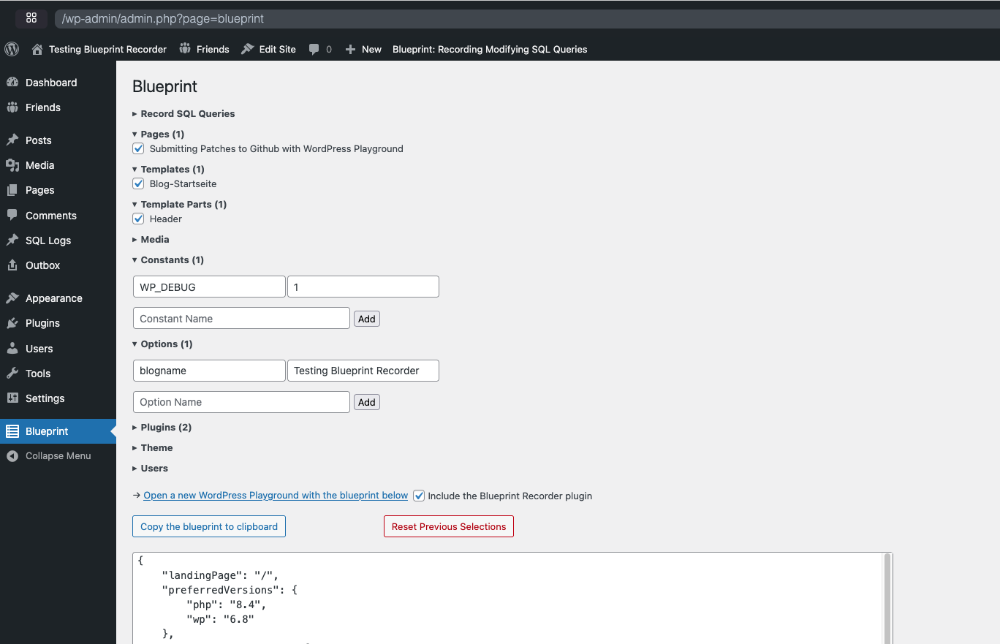

# Blueprint Recorder

This plugin assists you in creating a WordPress Playground Blueprint for the current site. It does this by

- Recording INSERT, UPDATE and DELETE statements,
- Creating a wp-admin page that allows selecting a subselection of important entities of the current site:



[Try it in WordPress Playground](https://playground.wordpress.net/#{%22steps%22:[{%22step%22:%22installPlugin%22,%22pluginData%22:{%22resource%22:%22url%22,%22url%22:%22https://github-proxy.com/proxy/?repo=akirk/blueprint-recorder&branch=main%22},%22options%22:{%22activate%22:true}}]}) or [build on it via the Step Library](https://akirk.github.io/playground-step-library/#eyJzdGVwcyI6W3sic3RlcCI6ImJsdWVwcmludFJlY29yZGVyIn1dfQ==)

It also exposes an autogenerated blueprint that can be loaded using the WordPress Playground:

```
https://playground.wordpress.net/?blueprint-url=https://URL/wp-json/playground/v1/blueprint
```

**Warning:** This plugin will also log most INSERT and UPDATE statements, so it is currently only intended to be used inside Playground itself. It can be used to receive a blueprint of an already configured playground.
